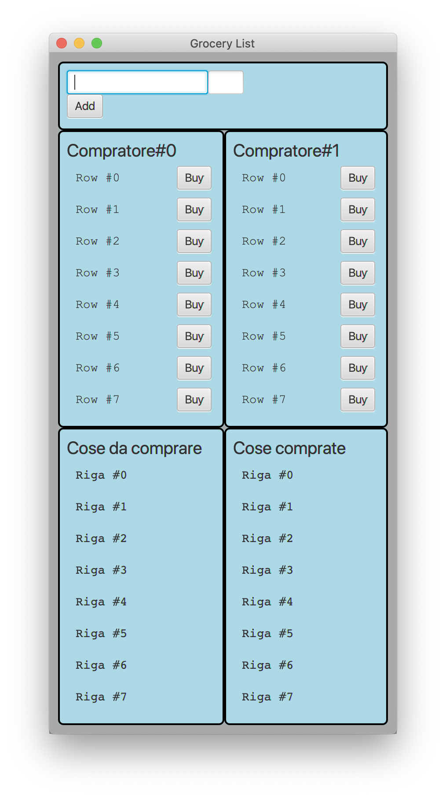
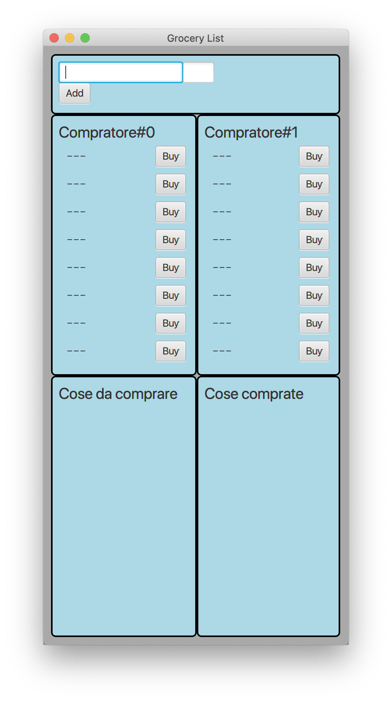
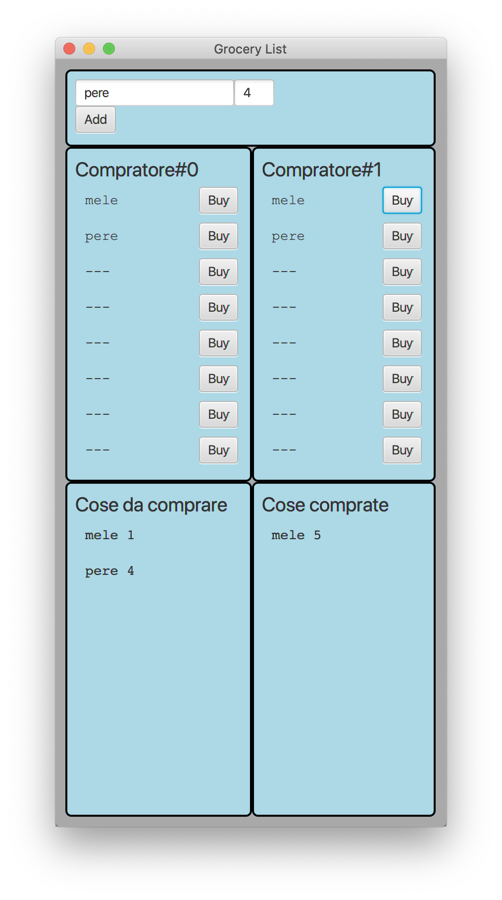
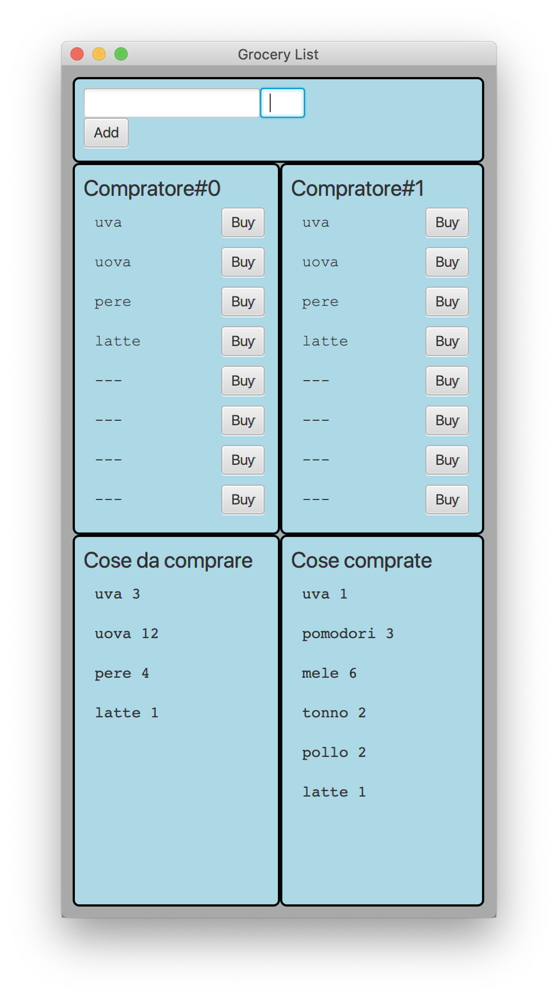

# LISTA DELLA SPESA CONDIVISA

Obiettivo dell'esercizio è progettare e realizzare un insieme di classi atte a produrre un semplice programma Java che
si occupi di gestire una lista della spesa condivisa.

Vengono fornite tre *Viste* del sistema:

- [`AdderView`](src/main/java/it/unimi/di/prog2/esame/view/AdderView.java): mette a disposizione due caselle di testo (
  articolo + quantità) e un bottone per aggiungere alla lista una certa *quantità* di un *articolo*.
- [`BuyerView`](src/main/java/it/unimi/di/prog2/esame/view/BuyerView.java): permette ai *compratori* di dichiarare (
  tramite pressione del bottone `Buy` relativo) di avere comprato un articolo tra quelli richiesti
- [`DisplayView`](src/main/java/it/unimi/di/prog2/esame/view/DisplayView.java): permette di visualizzare un elenco di
  articolo e quantità, usabile sia per gli articoli ancora da comprare sia per quelli già comprati.

Viene fornita anche una prima versione della classe  [`Main`](src/main/java/it/unimi/di/prog2/esame/Main.java) che
permette d'istanziare la parte statica delle viste, di una
interfaccia [`Presenter`](src/main/java/it/unimi/di/prog2/esame/presenter/Presenter.java) e della
classe  [`AdderPresenter`](src/main/java/it/unimi/di/prog2/esame/presenter/AdderPresenter.java) già predisposta a
ascoltare gli eventi del bottone della vista  [`AdderView`](src/main/java/it/unimi/di/prog2/esame/view/AdderView.java).

**TUTTE LE CLASSI DATE POSSONO ESSERE DA VOI MODIFICATE (CANCELLATE, COMPLETATE) PER ADERIRE A VOSTRE IDEE DI
PROGETTAZIONE**

Lanciando il programma (tramite il task `run` di gradle) si ottiene una interfaccia come quella nella figura
sottostante.

Allo stato attuale, la parte già implementata fa sì che:

- quando si preme il bottone `Add` viene chiamato il metodo `void action(int i, String text)`
  di [`AdderPresenter`](src/main/java/it/unimi/di/prog2/esame/presenter/AdderPresenter.java) che riceverà articolo e
  quantità da aggiungere
- nel caso della vista [`BuyerView`](src/main/java/it/unimi/di/prog2/esame/view/BuyerView.java), quando verrà
  chiamato il metodo `addHandlers`, al metodo `void action(int i, String text)` del Presenter collegato verranno passati
  il nome dell'articolo e la posizione (non è detto che servano entrambi ma a seconda dell'approccio usato potrebbe
  servire l'uno o l'altro)

## TRACCIA

Completare, in modo da realizzare un'organizzazione del sistema di tipo
*Model-View-Presenter*, le classi già presenti (`Main`, `AdderPresenter`) e aggiungere le classi necessarie (`ListModel`
, `BuyerPresenter`, ...) in modo che:

- alla pressione dei bottoni `Add` e `Buy` si aggiornino le varie viste

Alla partenza ci dovremo trovare nella seguente situazione:

Dopo avere indicato di aver bisogno di comprare **6 mele**...

Dopo avere indicato di avere bisogno anche di **4 pere** e avere comprato **5** delle **6 mele** richieste...

Da notare che ad esempio nella situazione corrente non sarebbe più possibile aggiungere nuovi articoli da comprare
essendone stati aggiunti già il numero massimo (`8` espresso dalla costante `Main.MAX_ALIMENTI`)

## ALTRE RICHIESTE E DOMANDA

Vi abbiamo al momento fornito classi concrete (e l'interfaccia `Presenter`), qualora lo riteneste utile per un buon design potete introdurre
astrazioni (interfacce o classi astratte), corredando l'aggiunta con la spiegazione del perché i cambiamenti effettuati
migliorano il progetto. Nel caso, invece, non riteneste opportuno l'uso di ulteriori interfacce e classi astratte,
motivate questa scelta.

## CONSEGNA

Creare uno file `.zip` il contenuto della directory `src` e l'eventuale file contenente la risposta alla domanda.

